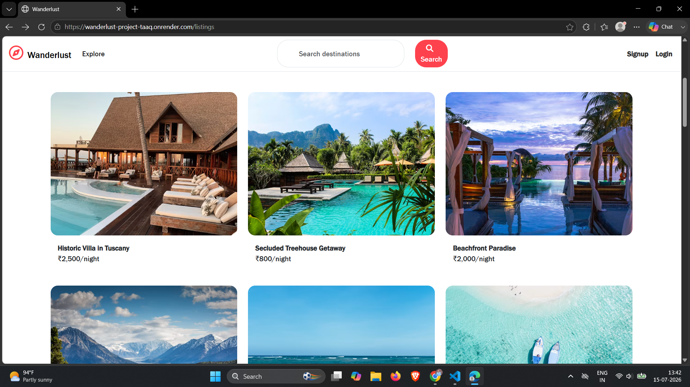
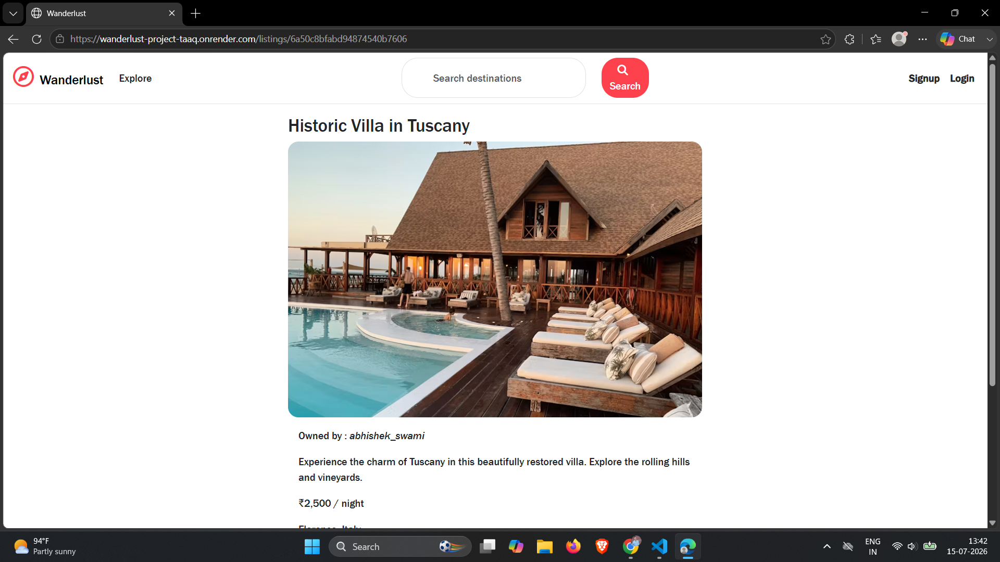
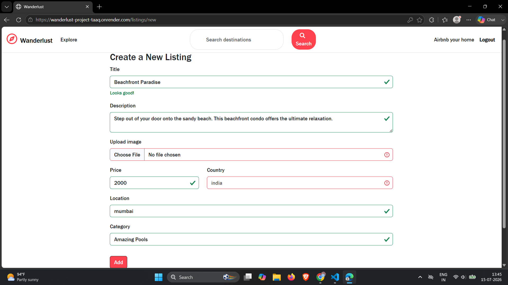

# 🌍 Wanderlust - Full Stack Airbnb Clone

A full-stack travel accommodation web application inspired by Airbnb, where users can explore, create, manage, and review travel property listings.

🔗 **Live Demo:** https://wanderlust-project-taaq.onrender.com/listings

---

## 📸 Preview

### Home Page


### Listing Details


### Create Listing


---

# 🚀 Features

### User Authentication
- Register new users
- Secure Login & Logout
- Password authentication using Passport.js
- Session management

### Authorization
- Only listing owners can edit their listings
- Only listing owners can delete their listings
- Only review authors can delete their reviews
- Protected routes

### Listings
- View all listings
- View listing details
- Create new listings
- Edit existing listings
- Delete listings
- Upload listing images

### Reviews
- Add reviews
- Give ratings
- Delete own reviews

### Image Upload
- Cloudinary integration
- Secure image storage

### Maps
- Interactive location map using Mapbox

### Responsive Design
- Mobile Friendly
- Tablet Friendly
- Desktop Friendly

### Error Handling
- Invalid routes
- Form validation
- Server-side validation
- Flash messages

---

# 🛠 Tech Stack

## Frontend

- HTML5
- CSS3
- Bootstrap 5
- JavaScript
- EJS

## Backend

- Node.js
- Express.js

## Database

- MongoDB Atlas
- Mongoose

## Authentication

- Passport.js
- passport-local
- express-session

## Cloud Storage

- Cloudinary
- Multer

## Maps

- Mapbox

## Deployment

- Render

## Version Control

- Git
- GitHub

---

# 📂 Project Structure

```
MAJORPROJECT/
│
├── controllers/
├── init/
├── models/
├── routes/
├── utils/
├── views/
│   ├── layouts/
│   ├── listings/
│   ├── users/
│   └── includes/
│
├── public/
│   ├── css/
│   ├── js/
│   └── images/
│
├── schemas.js
├── cloudConfig.js
├── app.js
├── package.json
└── README.md
```

---

# 📦 Installation

Clone the repository

```bash
git clone https://github.com/abhishek-kumar-builds/wanderlust-project.git
```

Move into the project directory

```bash
cd MAJORPROJECT
```

Install dependencies

```bash
npm install
```

Create a `.env` file

```env
ATLASDB_URL=your_mongodb_connection_string

SECRET=your_secret_key

CLOUD_NAME=your_cloudinary_name

CLOUD_API_KEY=your_api_key

CLOUD_API_SECRET=your_api_secret

MAP_TOKEN=your_mapbox_token
```

Run the project

```bash
node app.js
```

or

```bash
npm start
```

Open

```
http://localhost:8080/listings
```

---

# 📚 NPM Packages Used

- express
- mongoose
- ejs
- ejs-mate
- passport
- passport-local
- express-session
- connect-mongo
- multer
- multer-storage-cloudinary
- cloudinary
- joi
- method-override
- connect-flash
- dotenv
- mapbox-sdk

---

# 🔒 Authentication & Authorization

### Authentication

- User Signup
- User Login
- User Logout

### Authorization

- Only owners can edit listings
- Only owners can delete listings
- Only authors can delete reviews

---

# 🧠 What I Learned

This project helped me understand:

- MVC Architecture
- REST APIs
- CRUD Operations
- Authentication & Authorization
- Session Management
- Image Upload with Cloudinary
- MongoDB Relationships
- Schema Validation using Joi
- Deployment on Render
- MongoDB Atlas Configuration
- Debugging Production Issues
- Git & GitHub Workflow

---

# 💡 Future Improvements

- Search Functionality
- Category Filters
- Wishlist Feature
- Booking System
- Payment Gateway
- User Profile
- Notifications
- Admin Dashboard
- Dark Mode

---

# 🚀 Live Demo

https://wanderlust-project-taaq.onrender.com/listings

---

# 💻 GitHub Repository

https://github.com/abhishek-kumar-builds/wanderlust-project.git

---

# 🙋 Author

**Abhishek Kumar**

LinkedIn:
https://www.linkedin.com/in/abhishek-kumar-builds

GitHub:
https://github.com/abhishek-kumar-builds

---

# ⭐ Support

If you found this project helpful,

⭐ Star this repository

It motivates me to build more projects.

---

## 📜 License

This project is created for learning and educational purposes.
